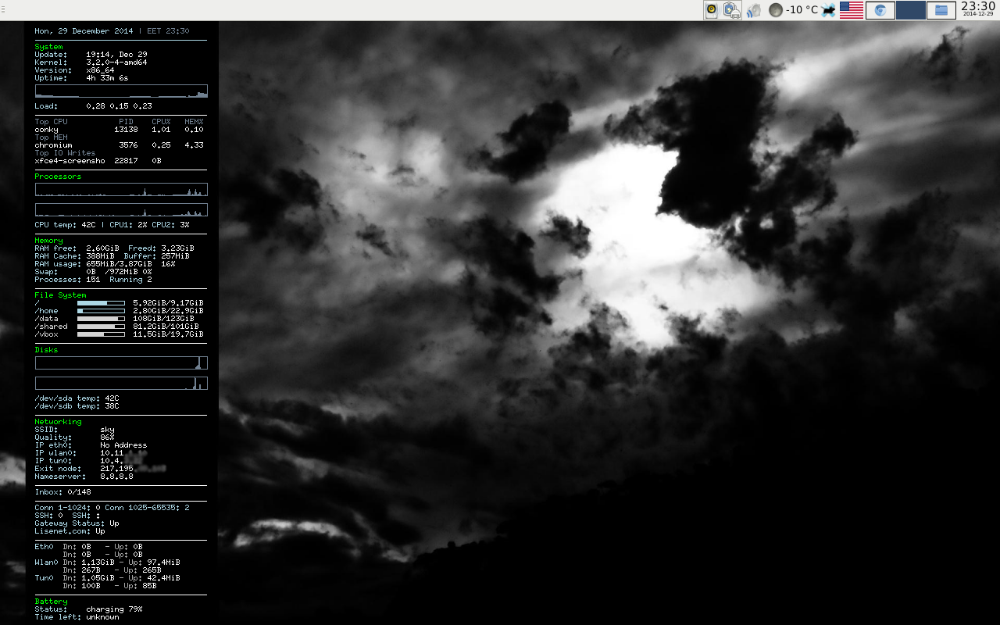

conky
=====

My Conky laptop configuration for Debian Wheezy.

# Installation on Debian Wheezy

The following packages are used by the script:
 
* conky
* wget
* lm-sensors
* hddtemp
* sudo
* stunnel4
 
To install:

<pre># apt-get install conky wget lm-sensors hddtemp sudo stunnel4 git</pre>

Fetch the configuration files from GitHub repository:

<pre>$ git clone https://github.com/crylium/conky.git ~/.conky</pre>

Create a symbolic link:

<pre>$ ln -s ~/.conky/conky.conf ~/.conkyrc</pre>

Copy the pingtest.sh file to <code>/usr/local/bin/</code>:

<pre># cp ~/.conky/pingtest.sh /usr/local/bin/</pre>

# Stunnel Configuration for IMAPS
Main <code>/etc/stunnel/stunnel.conf</code >config file:
<pre>[imaps]
client = yes
accept = 993
connect = mail.example.com:993</pre>

The line below should be present in <code>/etc/default/stunnel4</code>:
<pre>ENABLED=1</pre>

# Sudo Configuration for hddtemp

Add the following line to <code>/etc/sudoers</code>:
<pre>%disk ALL=(root) NOPASSWD: /usr/sbin/hddtemp</pre>
Add your regular user to the "disk" group:
<pre># usermod -aG disk username</pre>

